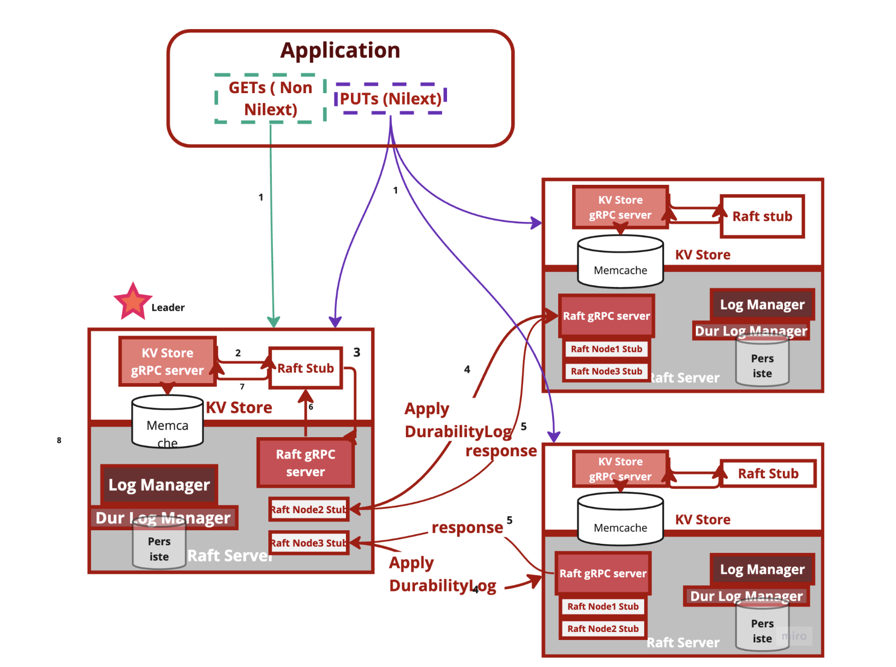
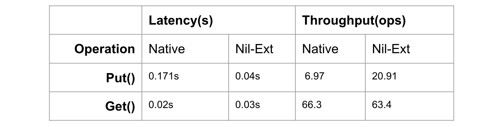
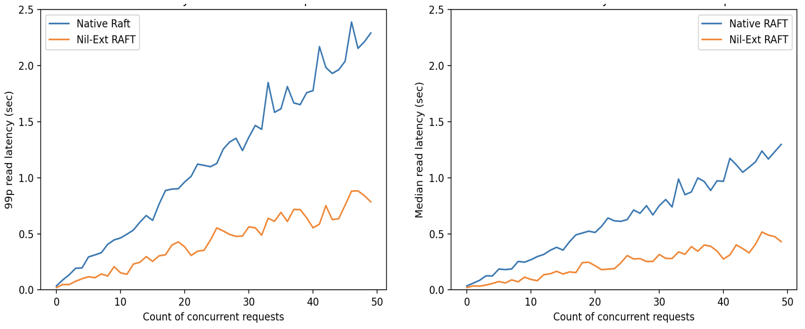

# Nil-Externality with RAFT Consensus 

### Goals
* Implement Nil-externalized interface on Raft [https://github.com/taabishm2/raft-kv-store](https://github.com/taabishm2/raft-kv-store). A nil-externalizing (nilext) interface may modify state within a storage system but does not externalize its effects or system state immediately to the outside world. As a result, a storage system can apply nilext operations lazily, improving performance.
* Evaluate correctness of implementation
* Evaluate performance difference because of deferred execution
* Conclude which workloads exploit Nil-Ext interface and which don’t.

# Architecture

# Benchmarking

